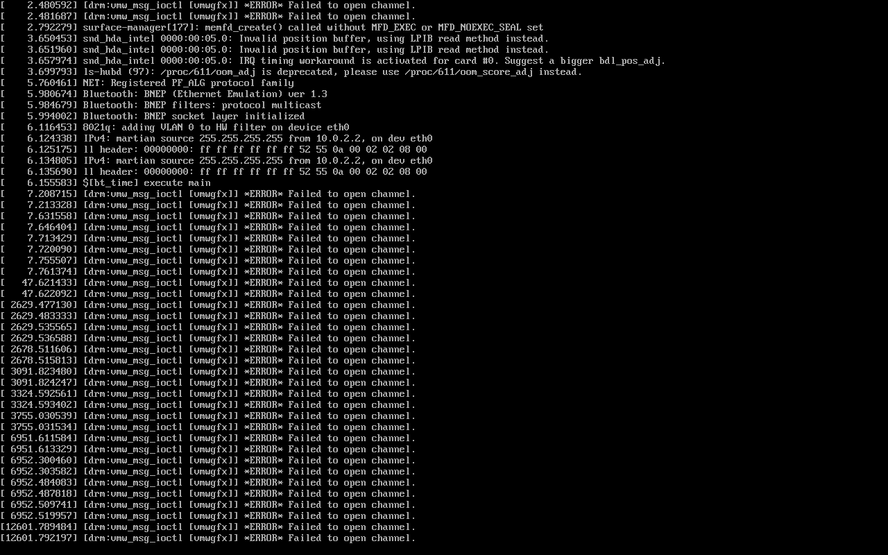

# pdk-luneos

Run legacy webOS **PDK/SDL** applications — the 2010–2012 native game catalogue —
on **LuneOS**.

Legacy PDK apps are ARMv7 **soft-float (softfp)** binaries linked against about
twenty Palm libraries, rendering straight to `/dev/fb0` through a proprietary
Qualcomm GL stack. LuneOS is hard-float, has no framebuffer console to hand to an
app, and none of those Palm libraries exist any more. This project replaces the
Palm side of that contract with clean-room reimplementations layered on modern
components (Mesa, SDL2 + sdl12-compat, glibc), so the original unmodified retail
binaries load and run.

Nothing here patches the games. Every binary tested is the one that shipped.

## Status

| | |
|---|---|
| Corpus | **478 of 583** native titles start and stay running — **81 %** |
| Symbol coverage | 560/560 apps fully resolved — no title fails for a missing entry point |
| Verified on | LuneOS `qemux86-64` emulator (composited by luna-surfacemanager) and an x86-64 workstation under `qemu-arm` |
| Not yet verified on | real ARM hardware (TouchPad / tenderloin) |

"Runs" means the process survives 45 s with a live window on the compositor. It is
a startup gate, not a playthrough — expect rough edges past the title screen.



## How it works, in one paragraph

Debian's **armel** port is byte-for-byte the PDK's ABI — the same EABI5 soft-float
calling convention — so a complete modern userland drops in with nothing to
recompile. The whole app process is softfp: game, SDL, Mesa, glibc. The boundary
with the hard-float host is the **Wayland socket**, not any function call. On top
of that base sit four small shims that supply what only Palm ever shipped:
`libpdl.so` (the PDK's own API, rewritten against LuneOS services), a
`libSDL-1.2.so.0` shim carrying webOS's SDL extensions over sdl12-compat,
`libGLES_CM.so` for the GLES1 extension entry points Mesa hides behind
`eglGetProcAddress`, and a `libSDL_cinema.so` stub for Palm's video library.

Full detail: **[docs/architecture.md](docs/architecture.md)**.

## Documentation

| | |
|---|---|
| [architecture.md](docs/architecture.md) | The ABI insight, the sysroot model, what each shim does and why |
| [building.md](docs/building.md) | Building the shims and the sysroot from source |
| [running.md](docs/running.md) | Deploying, launching, the full environment-variable reference, per-app `pdk.env` |
| [compatibility.md](docs/compatibility.md) | Corpus results, test methodology, the fixes ranked by titles recovered |
| [graphics.md](docs/graphics.md) | EGL/Mesa, the GLES-profile problem, performance measurements |
| [pipc.md](docs/pipc.md) | The luna-sysmgr PIpc wire protocol and the recovered 3.0.5 message IDs |
| [reverse-engineering.md](docs/reverse-engineering.md) | How the Palm binaries were analysed, and what may not be redistributed |
| [yocto.md](docs/yocto.md) | Building the whole thing as part of a LuneOS image |
| [troubleshooting.md](docs/troubleshooting.md) | Symptom → cause, including the mistakes that cost the most time |

## Quick start

```sh
make sysroot        # one-time; downloads Debian armel packages (~500 MB)
make                # build the four shims
make install        # stage them into the sysroot
```

Then run a game — on an x86 workstation against your own Wayland compositor:

```sh
tools/pdk-run /path/to/app theGameBinary
```

See [docs/building.md](docs/building.md) and [docs/running.md](docs/running.md).

## Repository layout

```
src/libpdl.c            libpdl.so, rewritten against LuneOS (68 PDL_* exports)
src/sdl_webos_shim.c    webOS's SDL extensions, layered over sdl12-compat
src/gles_oes_shim.c     libGLES_CM.so: the OES entry points Mesa hides
src/sdl_cinema_stub.c   libSDL_cinema.so stub (note: CIN_Init returns non-zero for success)
src/pdkhost.c           standalone PIpc host, for apps still on Palm's libnapp
src/crashcatch.c        LD_PRELOAD fault reporter (registers + resolved backtrace)
src/egltest.c           54-line EGL/GLES2 probe with no SDL in the way

tools/mk-sysroot.sh     builds the hybrid armel sysroot, unprivileged
tools/pdk-run           the launcher installed as /opt/pdk/pdk-run
tools/install-games.sh  unpack IPKs and install them so sam will launch them
tools/resolve-deps.py   resolve missing armel sonames against Debian Contents
tools/DecompileAll.java Ghidra headless script: decompile + call/string map

yocto/                  BitBake layer: builds all of the above into a LuneOS image
docs/                   see the table above
```

Not in git, by design: `sysroot/`, `reference/`, `testapp/`, `pkgcache/`. They hold
either half a gigabyte of regenerable downloads or material extracted from
proprietary webOS images — see [reverse-engineering.md](docs/reverse-engineering.md).

## Status of the Wayland shell problem — fixed

luna-surfacemanager used to advertise only `wl_shell` and `wl_webos_shell`.
`wl_shell` was deprecated in 2016 and removed from SDL2 in 2.0.16, so a modern
SDL2 could connect, bind `wl_compositor`, and then have no way to give its
surface a role — it never attached a buffer and the window silently never
appeared. That pinned the whole stack to SDL2 2.0.14.

`weboscompositor` now creates a `QWaylandXdgShell` alongside the existing
`QWaylandWlShell` and answers the initial configure (webOS surfaces are
fullscreen at the output size), so `xdg_wm_base` is advertised and current
toolkits map windows normally. The patch is
`0016-Advertise-xdg_wm_base-so-modern-toolkits-can-map-wind.patch` in
meta-luneos's luna-surfacemanager recipe.

With that in place the SDL2 pin is gone — the sysroot uses whatever SDL2 the
distro ships (2.30.1 in scarthgap).

## Licence

Apache-2.0 — see [LICENSE](LICENSE). This covers the code in this repository only.
It does not cover the Palm/HP libraries, fonts or application packages it
interoperates with, none of which are redistributed here.
